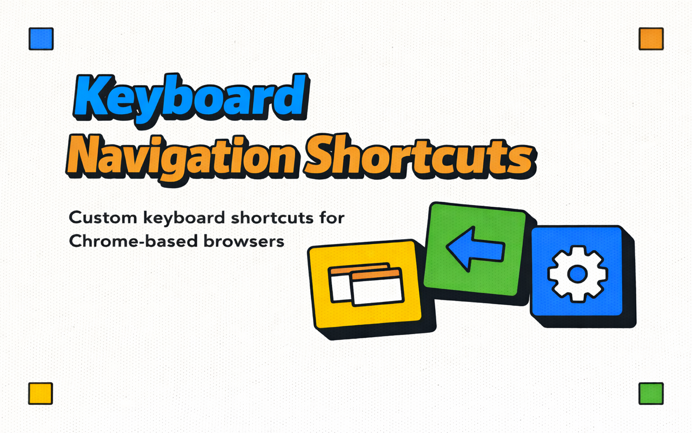

# Keyboard Navigation Shortcuts

[Chrome Web Store](https://chromewebstore.google.com/detail/keyboard-navigation-short/dgkjambikmmfmfmilabkammgbdjgffmk)

Customizable keyboard shortcuts for back/forward navigation and tab switching in Chrome-based browsers.

## Shortcuts

| Action           | Windows / Linux | macOS             |
| ---------------- | --------------- | ----------------- |
| Go back          | `Ctrl+K`        | `Command+K`       |
| Go forward       | `Ctrl+L`        | `Command+L`       |
| Switch tab left  | `Ctrl+Shift+K`  | `Command+Shift+K` |
| Switch tab right | `Ctrl+Shift+L`  | `Command+Shift+L` |

## Install

1. Install from the [Chrome Web Store](https://chromewebstore.google.com/detail/keyboard-navigation-short/dgkjambikmmfmfmilabkammgbdjgffmk).
2. Open extension shortcuts at `chrome://extensions/shortcuts` to customize keys.
